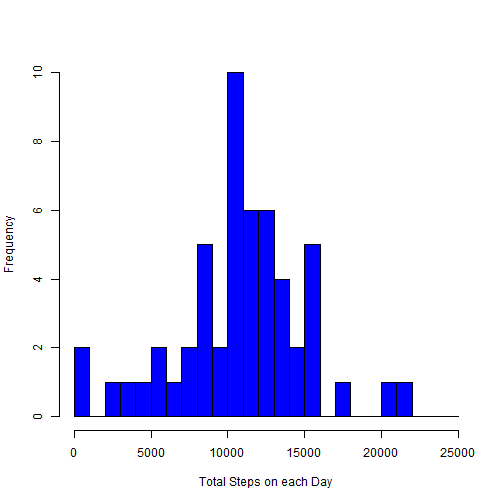
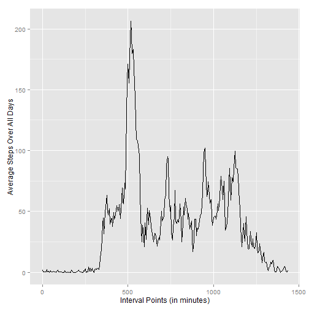
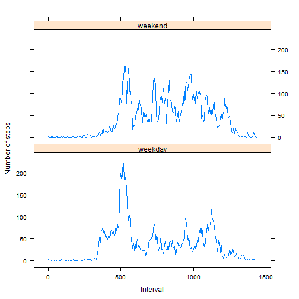

##Reproducible Research Project One - JHClass-Anon

````

Load helper functions and read in data file from working directory

```r
plotTotalSteps <- function(dfAvgs){
  dfStepSumsDaily <- as.data.frame(dtActivity[,sum(steps),by=date])
  hist(dfAvgs[,2], xlab="Total Steps on each Day", col="blue", breaks=seq(0,25000,by=1000), main="")
  sprintf("MEAN: %2.2f  MEDIAN:%3.2f", mean(dfAvgs[,2], na.rm=TRUE), median(dfAvgs[,2],na.rm=TRUE))
}

weekdayF <- function (x) {
  if (wday(x) == 1 || wday(x) == 7)
    day <- "weekend"
  else
    day <- "weekday"
}

dtActivity <-fread("activity.csv", sep=",", header=TRUE, colClasses=c("integer", "Date", "integer"), 
                    na.strings=("NA"))
```

                    
###What is mean total number of steps taken per day?
**Make a histogram of the total number of steps taken each day**
**Calculate and report the mean and median total number of steps taken per day**


```r
plotTotalSteps(as.data.frame(dtActivity[,sum(steps),by=date]))
```

 

```
## [1] "MEAN: 10766.19  MEDIAN:10765.00"
```

###What is the average daily activity pattern?
**Make a time series plot (i.e. type = "l") of the 5-minute interval (x-axis) and the average number of steps taken, averaged across all days (y-axis) **


```r
dfActivity <- cbind(as.data.frame(dtActivity), minInterval = as.integer(seq(from=0, to=1435, by=5)))
dfActivity <- as.data.table(dfActivity)
dfIntervalAvg <- as.data.frame(dfActivity[,mean(steps, na.rm=TRUE),by=minInterval])
dfActivity <- as.data.frame(dfActivity)
qplot(dfIntervalAvg[,1], dfIntervalAvg[,2], geom="line", xlab="Interval Points (in minutes)", ylab="Average Steps Over All Days")
```

 
  
**Which 5-minute interval, on average across all the days in the dataset, contains the maximum number of steps?**

```r
sprintf("5 minute interval with maximm number of steps is %4d with %5d steps", 
        as.integer(dfIntervalAvg[which.max(dfIntervalAvg[,2]),][1]),
        as.integer(dfIntervalAvg[which.max(dfIntervalAvg[,2]),][2]))
```

```
## [1] "5 minute interval with maximm number of steps is  515 with   206 steps"
```

###Imputing missing values
**Calculate and report the total number of missing values in the dataset (i.e. the total number of rows with NAs)**

```r
sprintf("Number of rows with NA is %5d", sum(!complete.cases(dtActivity)))
```

```
## [1] "Number of rows with NA is  2304"
```

**Devise a strategy for filling in all of the missing values in the dataset. The strategy does not need to be sophisticated.**
  
Used the strategy where NAs were imputed as mean of the steps for the interval.

**Create a new dataset that is equal to the original dataset but with the missing data filled in.**


```r
replaceRows <- unique (unlist (lapply (as.data.frame(dtActivity), function (x) which (is.na (x)))))

dfActivityNoNA <- dfActivity
for (i in replaceRows)
  dfActivityNoNA[i,1] <- dfIntervalAvg[1+dfActivityNoNA[i,4]/5,2]
```

**Make a histogram of the total number of steps taken each day and Calculate and report the mean and median total number of steps taken per day. Do these values differ from the estimates from the first part of the assignment? What is the impact of imputing missing data on the estimates of the total daily number of steps?**

Since the NAs were imputed with the mean, there is no change to the mean and it is the same as before. The median changes very slightly because of the addition of the new non-NA values that were not there before.


```r
dtActivityNoNA <- as.data.table(dfActivityNoNA)
plotTotalSteps(as.data.frame(dtActivityNoNA[,sum(steps),by=date]))
```

 

```
## [1] "MEAN: 10766.19  MEDIAN:10766.19"
```


##Are there differences in activity patterns between weekdays and weekends?

**Create a new factor variable in the dataset with two levels – “weekday” and “weekend” indicating whether a given date is a weekday or weekend day.**

```r
dfActivityNoNA <- cbind(dfActivityNoNA, dayType = factor(c("weekday", "weekend")))
dfActivityNoNA$dayType <- lapply (dfActivityNoNA$date, weekdayF)
```

**Make a panel plot containing a time series plot (i.e. type = "l") of the 5-minute interval (x-axis) and the average number of steps taken, averaged across all weekday days or weekend days (y-axis). **

```r
testI <- tapply(unlist(dfActivityNoNA$steps), 
                INDEX=list(unlist(dfActivityNoNA$dayType), unlist(dfActivityNoNA$minInterval)), FUN=mean)
testI <- melt(testI, rownames(testI))
colnames(testI) <- c("dayType", "minInterval", "steps")
xyplot(steps ~ minInterval | dayType, data = testI, layout = c(1,2), type="l", 
       xlab="Interval", ylab="Number of steps")
```

 


